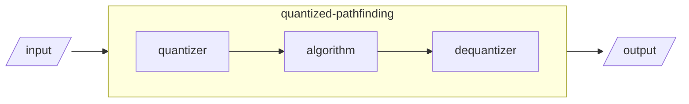

# Quantized-pathfinding

<video 
src='https://recruiter-magnet.lukeyoo.fyi/static/videos/q_astar2d.mp4'></video>

## Motivation

I had a picking plugin, which is getting bloated. So i decided to separate 
the algorithmic part.

## Currently working algorithm(s)

- `quantized_astar`

## How does this work

This preprocesses the input before the target algorithm(pathfinding)
and roughly recovers the output.

## Why shoud i use this?

Indeed(to just use algorithm), you don't need to use this. 
You can, for example, implement float-like type to directly work with 
pathfinding](https://docs.rs/pathfinding/latest/pathfinding/).

## QnA

**What'd be different from theory?**

It's finite. Use the boundry instead of infinity in 
[from-book procedures](https://lukeyoo.fyi/recap/2025/5/dijkstra).

**Any unobvious catch?**

The input type seems very generous but it may need more traits or method 
**as you need** within the explorative body of the algorithm.
