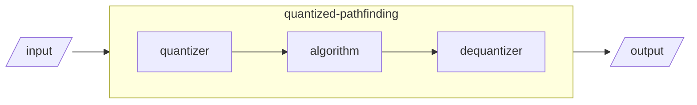

# Quantized-pathfinding

<video src="https://github.com/user-attachments/assets/962aead2-a4d6-4fb0-a127-3125184f791d"></video>

## Motivation

I had a picking plugin, which is getting bloated. So i decided to separate 
the algorithmic part.

## Currently working algorithm(s)

- `quantized_astar`

## How does this work

This [transforms](https://lukeyoo.fyi/recap/2025/5/linear-quantization) 
the input before the target algorithm(pathfinding) and roughly recovers 
the output.



## Why shoud i use this?

Indeed(to just use algorithm), you don't need to use this. 
You can, for example, implement float-like type to directly work with 
[pathfinding](https://docs.rs/pathfinding/latest/pathfinding/).

## QnA

**What'd be different from theory?**

It's finite. Use the boundry instead of infinity in 
[from-book procedures](https://lukeyoo.fyi/recap/2025/5/dijkstra).

**Any unobvious catch?**

The input type seems very generous but it may need more traits or method 
**as you need** within the explorative body of the algorithm.

## Example

```rust
use quantized_pathfinding::{
    directed::*,
    traits::*,
    utils::quantizer::Quantizer,
};

const N_LEVELS: [usize; 2] = [8, 8];
const VEC_A: [f32;2] = [0.0, 0.0];
const VEC_B: [f32;2] = [10.0, 10.0];
const START: [f32;2] =  [1.0, 1.0];
const GOAL: [f32;2] = [9.0, 10.0];

fn main() {
    let solution = q_astar2d_mini();
    for (v1, v2) in solution {
        println!("({:.2},{:.2}) -> ({:.2},{:.2})", v1[0], v1[1], v2[0], v2[1]);
    }
}

fn q_astar2d_mini() -> Vec<([f32; 2], [f32; 2])>{
    let quantizer2d = Quantizer::<f32, 2>::with_n(
        VEC_A, VEC_B, N_LEVELS
    );
    let goal_n = quantizer2d.quantize(GOAL);
    let result = quantized_astar(
        &quantizer2d, START,
        |&[x, y]| {
            let mut neighbors = vec![];
            for &[dx, dy] in &[[1, 0], [-1, 0],[0, 1],[0, -1]] {
                let nx = x as i32 + dx;
                let ny = y as i32 + dy;
                if nx >= 0 && ny >= 0 && nx < N_LEVELS[0] as i32 && 
                    ny < N_LEVELS[1] as i32 {
                    neighbors.push(([nx as usize, ny as usize], 1));
                }
            }
            neighbors
        },
        |&[x, y]| { 0 as u32 },
        |&p| p == goal_n,
    );
    let mut drawable_paths: Vec<([f32; 2], [f32; 2])> = vec![];
    match result {
        Some((path, cost)) => {
            println!("Found 2D path with cost {} ({} steps):", cost, path.len());
            let mut pos_old: [f32; 2] = START;
            for (_, pos_new) in path.iter().enumerate() {
                drawable_paths.push((pos_old, *pos_new));
                pos_old = pos_new.clone();                
            } 
        }
        None => println!("No 2D path found"),
    }
    drawable_paths
}
```