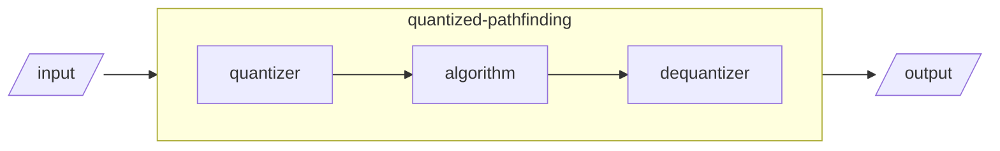

# Quantized-pathfinding

## Motivation

I had a picking plugin, which is getting bloated. So i decided to separate 
the algorithmic part.

## Currently working algorithm(s)

None! I need to de-mess(yuk!) my code(which seems 
[working](https://youtu.be/JAGTxxRinCU)) before publishing :p

`quantized_astar` will be done in a week(will be done before 05-31-2025).

## How does this work

This preprocesses the input before the target algorithm(pathfinding)
and roughly recovers the output.

## Why shoud i use this?

Indeed(to just use algorithm), you don't need to use this. 
You can, for example, implement float-like type to directly work with 
pathfinding](https://docs.rs/pathfinding/latest/pathfinding/).

## QnA

**What'd be different from theory?**

It's finite. Use the boundry instead of infinity in [from-book procedures](https://lukeyoo.fyi/recap/2025/5/dijkstra).

**How to use them?**

You'd probably mix with other functionalities or algorithms.

**Any unobvious catch?**

The input type seems very generous but it may need more traits or method **as you need** within the explorative body of the algorithm.
