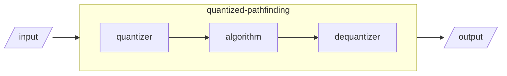

# Quantized-pathfinding

## Motivation

I had a picking plugin, which is getting bloated. So i decided to separate 
the algorithmic part.

## Currently working algorithm(s)

None! I need to de-mess(yuk!) my code(which seems 
[working](https://youtu.be/JAGTxxRinCU)) before publishing :p

`quantized_star` will be done in a week(will be done before 05-31-2025).

## How does this work

This preprocesses data before target algorithm(`pathfinding`)
and recovers the output(lossy).

## Why shoud i use this?

Indeed(to just use algorithm), you don't need to use this. 
You can, for example, implement float-like type to directly work with 
pathfinding](https://docs.rs/pathfinding/latest/pathfinding/).
